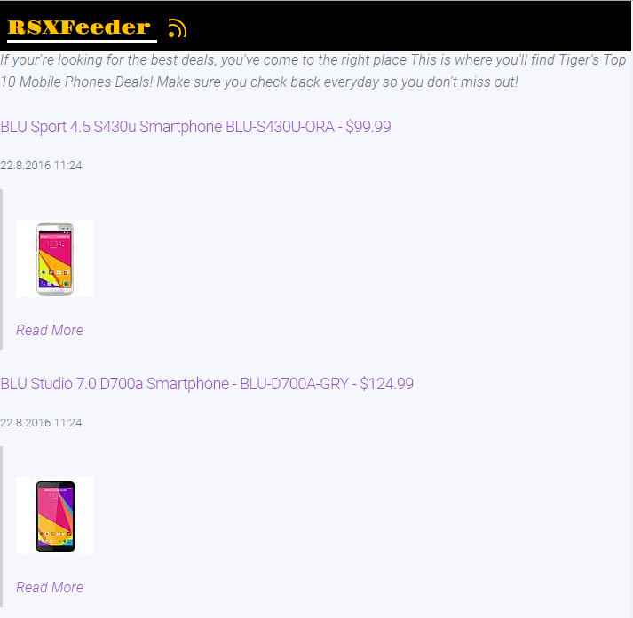
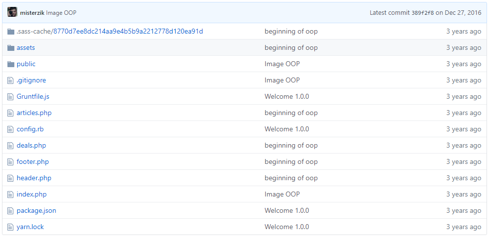

# RSSXFeed

 

### Behind the scenes

It's end of 2016, A new request comes in from another Media Agency company, They had build multiple XML colocations with data spitting out from a MySQL DB,
In this integration, we do not touch any databases, the approach is to be able to read from xml using PHP and be able to duplicate this micro-sites all over the net for all their clients. 

### Legacy Dependencies :

1) PHP
2) XML

### History Snapshot:

so why snapshot's? in order to be able to make all this public, there is a lot of clean up to do specially with some of this old deprecated code and private tokens, so in order for me to do that i've to erase all commits for all our script kiddies out there.

